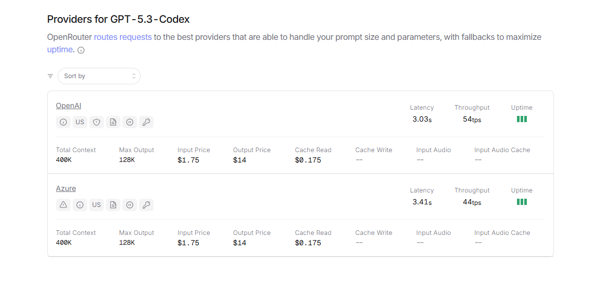
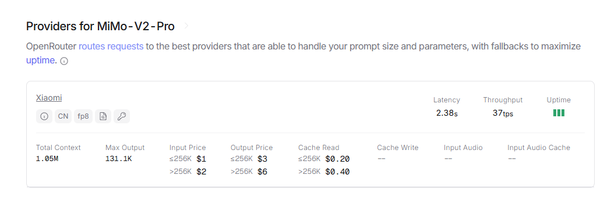
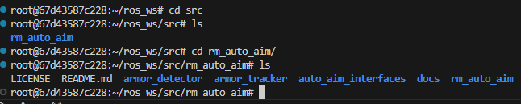
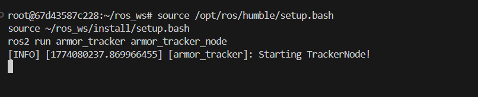
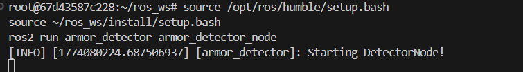

# MIMO V2 Pro


一个很有趣的现象，MIMO V2 Pro的上下文是codex的2倍多...高达1M
# 自瞄算法学习
https://deepwiki.com/FaterYU/rm_auto_aim/1-overview
自瞄系统作为视觉流水线运行，以30-60HZ处理相机图像，并为万向节控制系统输出目标状态信息
## 项目部署
启动docker的ros容器，在vscode中连接到容器的终端，执行以下命令：
```
cd ros_ws/src
git clone https://github.com/FaterYU/rm_auto_aim.git
cd ..
 
# Install dependencies using rosdep
rosdep install --from-paths src --ignore-src -r -y
 
# Build the system
colcon build --symlink-install --packages-up-to rm_auto_aim
```
## 代码包概览

armor_detector：装甲板识别包，实现图像处理 + 灯条配对 + 数字分类 + PnP测距。
armor_tracker：目标跟踪包，实现坐标变换 + 跟踪状态机 + EKF。
auto_aim_interfaces：ROS2 消息定义包，给识别/跟踪节点通信用。
rm_auto_aim：元包（meta package），本身基本不放业务代码，只做依赖聚合。

## armor_detector

