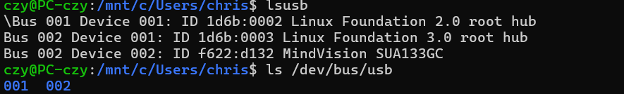
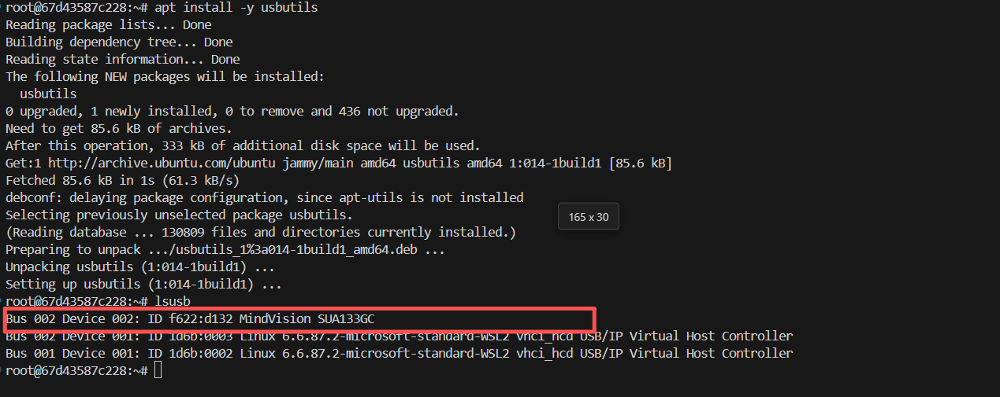

# 卡尔曼滤波和MPC
https://www.bilibili.com/video/BV1ez4y1X7eR/?spm_id_from=333.337.search-card.all.click&vd_source=f5dc71dce99e951e4437ffdb7af02c12，https://www.bilibili.com/video/BV1cL411n7KV/?spm_id_from=333.1387.collection.video_card.click&vd_source=f5dc71dce99e951e4437ffdb7af02c12，学习了下b站这个博主的关于卡尔曼滤波和MPC的讲解

# 自瞄算法研读
## 串口通信协议
视觉系统发送给电控的数据
1. 固定包头(0xA5)和包序号
2. 如果使用自瞄，发送开火许可、俯仰角和偏航角的变化信息;如果不使用自瞄，禁止开火，俯仰角和偏航角设置为0
3. 底盘控制数据，包含x轴、y轴的线速度和z轴的角速度，也就是沿着x轴、y轴方向平移的速度和绕z轴旋转的速度
4. 添加循环冗余校验码，保证数据的正确性

电控板发送给视觉系统的数据
1. 固定包头(0x5A)
2. 云台和地盘状态信息，包括子弹射速、云台的俯仰角、偏航角、旋转角，底盘的俯仰角，敌方的颜色
3. 比赛状态信息，包括比赛阶段(未开始、准备、自检、5秒倒计时、比赛中)、当前阶段剩余时间、当前机器人血量、被击打的装甲板ID、伤害类型、敌方和我方的基地与前哨战血量对比
4. 循环冗余检验码

## 连接相机
首先需要在Windows以管理员模式安装usbipd工具，使用以下命令将相机绑定到WSL中，是核心步骤
```
usbipd bind --busid 1-17 --force
usbipd attach --wsl --busid 1-17
```
可以验证一下
```
sudo apt install -y usbutils
lsusb
ls /dev/bus/usb
```

然后进入容器
```
apt update
apt install -y usbutils
lsusb
```


docker.exe run --rm -it \
  --privileged \
  -v /dev/bus/usb:/dev/bus/usb \
  autoaim_with_code \
  bash

